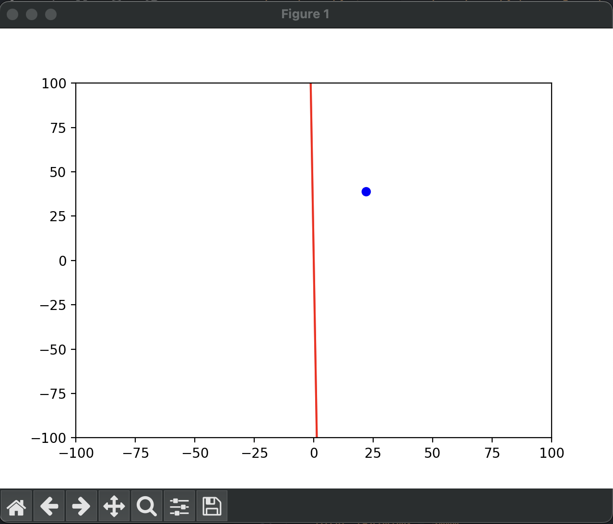
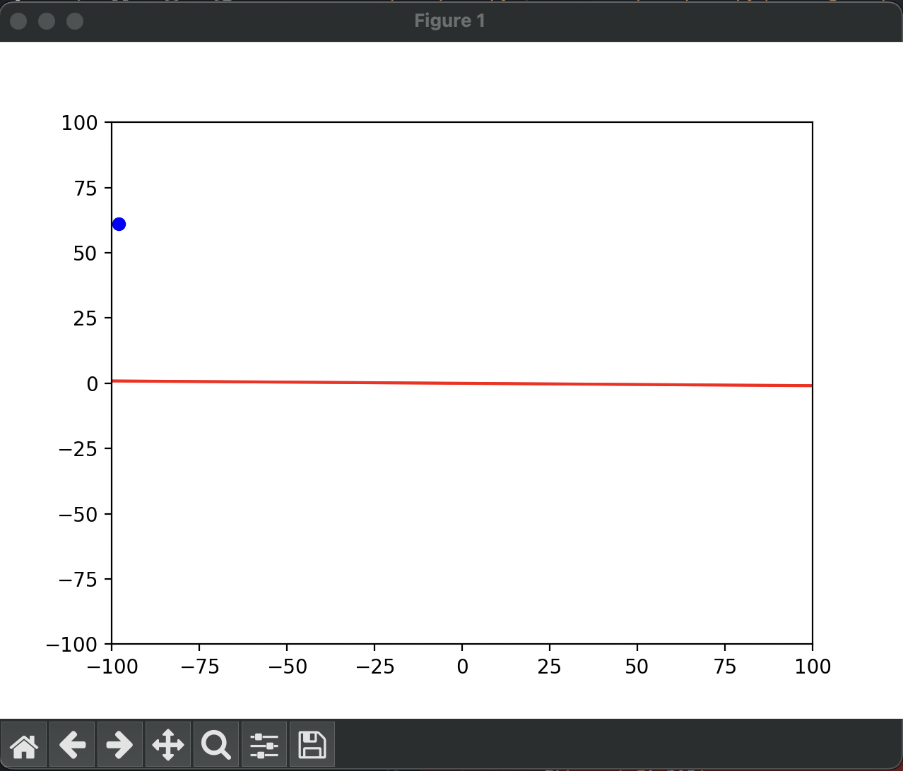
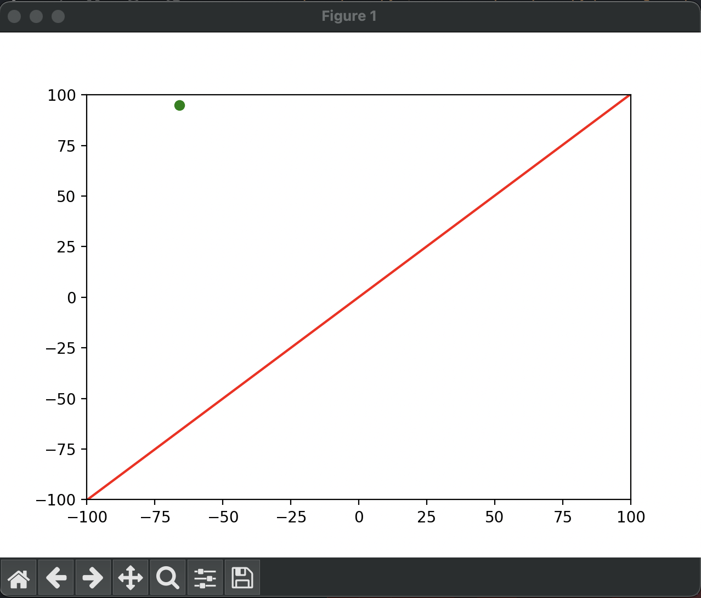

# Perceptron Learning Algorithm

## Overview

This Python code implements a simple **Perceptron**, which is one of the foundational algorithms in machine learning for binary classification tasks. The perceptron learns a linear decision boundary to separate data points into two classes: +1 and -1.

## How the Code Works

1. **Initialization**:
    - The perceptron initializes the weight vector and bias to zero.
  
2. **Prediction**:
    - For a given input vector `X`, the perceptron computes a weighted sum of the inputs and applies a step function (activation function) to classify the input as either +1 or -1.

3. **Training**:
    - During training, the perceptron compares its prediction with the actual expected output and adjusts the weights and bias if the prediction is incorrect.
  
4. **Visualization**:
    - The code dynamically plots the decision boundary that the perceptron is learning, and the scatter points represent the data points classified as either +1 or -1 (blue for +1, green for -1).
  
## Function Explanation

- **`Perceptron` Class**:
    - Implements the basic perceptron logic with functions for prediction (`predict`) and training (`train`).

- **`predict_y_equal_zero()`**:
    - Generates a random point and returns +1 if the point is above the line `y=0`, and -1 if it is below.

- **`predict_x_equal_zero()`**:
    - Similar to `y=0`, it predicts based on whether the point is to the right or left of the line `x=0`.

- **`predict_y_equal_x()`**:
    - Predicts whether the point lies above or below the line `y=x`.

### Code Usage

The code trains the perceptron on random points and visualizes how the decision boundary changes over time.

- You can modify the function `predict_y_equal_zero()` to experiment with different classification rules, such as using the function `predict_x_equal_zero()` or `predict_y_equal_x()`.

### Images Explanation

Below are some visualizations of the decision boundary learned by the perceptron after training for different functions.

1. **Decision Boundary for `x = 0`**

    

    The perceptron learns the decision boundary `x = 0` and classifies points on either side.

2. **Decision Boundary for `y = 0`**

    

    The perceptron learns the decision boundary `y = 0` and separates points above and below the line.

3. **Decision Boundary for `y = x`**

    

    The perceptron learns the decision boundary `y = x`, where points above the line are classified as +1, and those below as -1.

### Final Weights and Bias

At the end of the training, the perceptron prints the final weights and bias, representing the learned decision boundary.

```bash
Final Weights: [w1, w2]
Final Bias: b
